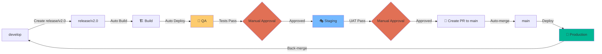

# Release Multi-Entorno - Implementación de Ejemplo

Sistema de automerge para gestionar deployments automáticos a través de múltiples entornos (QA → Staging → Production) con approval gates manuales y validaciones automáticas.

## ✅ Estado del Submódulo

- ✅ Pipeline multi-entorno configurado
- ✅ Deployment a QA, Staging y Production
- ✅ Approval gates con GitHub Environments
- ✅ Back-merge automático a develop
- ✅ Scripts de ayuda incluidos

## 📁 Estructura del Proyecto

```
.
├── .github/
│   ├── templates/                 # Templates para PR bodies
│   │   ├── release_pr_body.md     # Template para PRs de release
│   │   ├── backmerge_pr_body.md   # Template para back-merge sin conflictos
│   │   └── backmerge_pr_body_conflicts.md  # Template para back-merge con conflictos
│   └── workflows/
│       └── release-pipeline.yml   # Pipeline completo QA→Staging→Prod
├── scripts/
│   ├── check_repo_config.sh       # Verificar configuraciones del repo
│   ├── create-labels.sh           # Crear labels necesarios
│   ├── create-release-branch.sh   # Crear ramas de release
│   └── setup-environments.sh      # Guía de configuración de environments
├── src/
│   └── app/                       # Aplicación Next.js (a crear)
└── README.md
```

## 🎯 Casos de Uso

- Deployments progresivos a través de múltiples entornos
- Validación automatizada en cada ambiente
- Control de releases con approval gates manuales
- CI/CD enterprise con múltiples stages
- Gestión de releases con back-merge automático

## 🔄 Flujo de Trabajo



## 🚀 Guía de Implementación Paso a Paso

### 1. Configurar GitHub Environments (15 minutos)

Los environments son esenciales para este flujo. Deben configurarse en **Settings > Environments**.

#### A. Environment: QA

1. Click **New environment**
2. Name: `qa`
3. **Configure environment**:
   - ☐ Required reviewers: **ninguno** (auto-deploy)
   - ☐ Wait timer: 0 minutes
   - Deployment branches: `Selected branches` → `release/*`

4. **Environment variables** (opcional):
   - `QA_API_URL`: `https://api-qa.tuapp.com`
   - `ENV_NAME`: `qa`
   - `LOG_LEVEL`: `debug`

#### B. Environment: Staging

1. Click **New environment**
2. Name: `staging`
3. **Configure environment**:
   - ☑ **Required reviewers**: Agregar 1-2 reviewers del equipo
   - ☑ **Prevent administrators from bypassing**: ON
   - Deployment branches: `Selected branches` → `release/*`

4. **Environment variables** (opcional):
   - `STAGING_API_URL`: `https://api-staging.tuapp.com`
   - `ENV_NAME`: `staging`
   - `LOG_LEVEL`: `info`

#### C. Environment: Production

1. Click **New environment**
2. Name: `production`
3. **Configure environment**:
   - ☑ **Required reviewers**: Agregar 2+ reviewers (senior team)
   - ☑ **Prevent administrators from bypassing**: ON
   - ☑ **Wait timer**: 5 minutes (cooldown antes de aprobar)
   - Deployment branches: `Only protected branches` → main

4. **Environment variables** (opcional):
   - `PROD_API_URL`: `https://api.tuapp.com`
   - `ENV_NAME`: `production`
   - `LOG_LEVEL`: `warn`

**💡 Script de ayuda**:

```bash
./scripts/setup-environments.sh
```

### 2. Configurar Branch Protection (10 minutos)

#### Para `main`:

**Settings > Branches > Add branch protection rule**:

```
Branch name pattern: main

☑ Require a pull request before merging
  ☑ Require approvals: 2
☑ Require status checks to pass before merging
  ☑ Require branches to be up to date
  Status checks:
  - 🏗️ Build Release Artifacts
☑ Require conversation resolution before merging
☑ Allow auto-merge
☑ Do not allow bypassing
```

#### Para `release/*`:

```
Branch name pattern: release/*

☑ Require a pull request before merging
  ☑ Require approvals: 1
☑ Require status checks to pass before merging
  Status checks:
  - 🧪 Deploy to QA
```

#### Para `develop`:

```
Branch name pattern: develop

☑ Require a pull request before merging
  ☑ Require approvals: 1
☑ Require status checks to pass
☑ Allow force pushes: OFF
```

### 3. Crear Aplicación Next.js (Opcional)

Si aún no tienes una aplicación, puedes crear una simple:

```bash
cd src
npx create-next-app@latest app --typescript --tailwind --app --no-src-dir
cd app
npm install
```

O usar la aplicación de ejemplo de otro submódulo:

```bash
cp -r ../AutoMergeFeature/src/app src/
```

### 4. Configurar Permisos de GitHub Actions

**Settings > Actions > General > Workflow permissions**:

- ☑ **Read and write permissions**
- ☑ **Allow GitHub Actions to create and approve pull requests**

### 5. Primera Prueba - Crear Release (20 minutos)

#### Opción A: Usar el Script

```bash
./scripts/create-release-branch.sh
# Ingresa: v1.0
```

#### Opción B: Manual

```bash
# Asegurarse de estar en develop actualizado
git checkout develop
git pull origin develop

# Crear rama de release
git checkout -b release/v1.0

# Opcional: actualizar version en package.json
cd src/app
npm version 1.0.0 --no-git-tag-version
cd ../..

git add .
git commit -m "chore: Bump version to v1.0"
git push -u origin release/v1.0
```

#### Observar el Pipeline

1. Ve a **Actions** en GitHub
2. Verás el workflow `🚀 Release Multi-Environment Pipeline`
3. Observa cada stage:

**Stage 1: Build** (automático)

- ✅ Compila la aplicación
- ✅ Ejecuta linter
- ✅ Sube artifacts

**Stage 2: Deploy QA** (automático)

- ✅ Descarga artifacts
- ✅ Deploys a QA
- ✅ Ejecuta smoke tests
- ✅ Health check

**Stage 3: Deploy Staging** (requiere aprobación)

- ⏸️ **PAUSA** - Espera aprobación manual
- Ve a Actions > Workflow run > Review deployments
- Selecciona `staging` y aprueba
- ✅ Deploys a Staging
- ✅ Ejecuta UAT tests

**Stage 4: Create PR** (automático)

- ✅ Crea tag de versión
- ✅ Genera release notes
- ✅ Crea PR a `main`
- ✅ Habilita auto-merge

**Stage 5: Deploy Production** (requiere aprobación)

- ⏸️ **PAUSA** - Espera aprobación manual (después de merge a main)
- Aprobar desde el environment `production`
- ⏳ Wait timer de 5 minutos
- ✅ Deploys a Production
- ✅ Health checks
- ✅ Smoke tests

**Stage 6: Back-merge** (automático vía PR)

- ✅ Crea rama de back-merge
- ✅ Crea PR de `main` → `develop`
- ✅ Habilita auto-merge (si no hay conflictos)
- ⏸️ Espera aprobación (si develop está protegida)
- ✅ Sincroniza develop con producción

### 6. Aprobar Deployments

Cuando el workflow llegue a Staging o Production:

```bash
# Ver deployments pendientes
gh run list --workflow="Release Multi-Environment Pipeline"

# O desde la UI de GitHub
# Actions > <workflow run> > Review deployments
```

En la UI verás:

```
Review pending deployments
☐ staging
☐ production

[Approve and deploy] [Reject]
```

## 🔍 Comandos Útiles

```bash
# Crear rama de release
./scripts/create-release-branch.sh

# Ver estado del pipeline
gh run list --workflow="Release Multi-Environment Pipeline"

# Ver logs de un workflow
gh run view <RUN_ID> --log

# Ver deployments recientes
gh api repos/:owner/:repo/deployments | jq '.[] | {id, environment, created_at}'

# Ver environments configurados
gh api repos/:owner/:repo/environments | jq '.environments[] | {name, protection_rules}'

# Ver PRs de release
gh pr list --label release

# Ver tags de release
git tag -l "v*"

# Rollback (revertir commit en main)
git revert <COMMIT_HASH>
git push origin main
```

## 📊 Monitoreo del Pipeline

### Dashboard en Actions

El workflow genera un **Step Summary** con información detallada:

```
### 🏗️ Build Complete
- Version: release/v1.0
- Commit: a1b2c3d
- Node: 20

### 🧪 QA Deployment
- Status: ✅ Deployed
- URL: https://qa.tuapp.com
- Time: 2026-02-07T10:15:30Z

### 🎭 Staging Deployment
- Status: ✅ Deployed
- URL: https://staging.tuapp.com
- Approved by: @user

### 🚀 Production Deployment
- Version: v1.0
- Status: ✅ Deployed
- URL: https://tuapp.com
- Deployed by: @user
```

### Ver Deployments por Environment

```bash
# Ver último deployment de cada environment
gh api repos/:owner/:repo/deployments \
  | jq 'group_by(.environment)[] | {environment: .[0].environment, latest: .[0].created_at}'
```

## 🛠️ Troubleshooting

### Deployment Falla en QA

```bash
# Ver logs completos
gh run view --log

# Re-ejecutar solo el job de QA
gh run rerun <RUN_ID> --job="deploy-qa"

# Ver artifacts generados
gh run view <RUN_ID> --log | grep "Upload build artifacts"
```

### Approval Bloqueado

Si un reviewer no está disponible:

1. **Temporal**: Ajusta required reviewers en environment a 0-1
2. **Permanente**: Configura reviewers alternativos
3. **Emergency**: Desactiva temporalmente environment protection

```bash
# Ver quiénes pueden aprobar
gh api repos/:owner/:repo/environments/staging \
  | jq '.protection_rules[].reviewers'
```

### PR No Se Crea Automáticamente

Verificar:

- GitHub Actions tiene permisos de write
- Branch `main` existe
- No hay PR existente para esa release branch

```bash
# Ver PRs existentes
gh pr list --head release/v1.0

# Crear PR manualmente
gh pr create --base main --head release/v1.0 \
  --title "Release: v1.0" \
  --label "release"
```

### Back-merge Falla o Tiene Conflictos

Si el back-merge automático tiene conflictos:

**El workflow creará un PR** que deberás resolver manualmente:

```bash
# Ver PR de back-merge pendiente
gh pr list --label "back-merge"

# Checkout del PR y resolver conflictos localmente
gh pr checkout <PR_NUMBER>
git merge origin/main
# Resolver conflictos
git add .
git commit -m "chore: Resolve back-merge conflicts"
git push

# O resolver en la UI de GitHub usando el web editor
```

**Si develop está protegida** (escenario actual):

- El workflow crea un PR automáticamente
- Aprueba el PR desde la UI de GitHub
- Se hace merge automático (si auto-merge está habilitado)

### Rollback de Production

```bash
# Opción 1: Revert del commit
git checkout main
git revert <COMMIT_HASH>
git push origin main

# Opción 2: Deploy de versión anterior
# Ejecutar workflow dispatch con versión anterior
gh workflow run release-pipeline.yml \
  -f environment=production \
  -f release_branch=release/v0.9
```

## 📊 Ejemplo de Flujo Completo

```bash
# Día 1: Crear release desde develop
git checkout develop
git pull
./scripts/create-release-branch.sh
# > Ingresa: v2.0

# Automático: Pipeline se ejecuta
# - Build: ✅ 2 min
# - QA Deploy: ✅ 3 min
# - QA Tests: ✅ 5 min

# Día 2: QA validation completa
# Aprobar Staging deployment en GitHub UI
# - Staging Deploy: ✅ 3 min
# - UAT Tests: ✅ 10 min

# Día 3: UAT completo
# - PR creado automáticamente a main
# - Reviewers aprueban el código
# - Auto-merge fusiona a main

# Día 4: Production deployment
# Aprobar Production deployment en GitHub UI
# - Wait timer: 5 min
# - Production Deploy: ✅ 5 min
# - Health Checks: ✅ 2 min
# - Back-merge PR created: ✅ 1 min

# Día 5: Aprobar back-merge (si develop está protegida)
# - Review back-merge PR
# - Auto-merge completes: ✅

# ✅ Release completo!
```

## 🔐 Seguridad y Compliance

### Pre-Deployment Checks

Cada environment ejecuta:

1. **Build Validation**: Código compila sin errores
2. **Linting**: Calidad de código
3. **Health Checks**: Endpoints responden
4. **Smoke Tests**: Funcionalidad básica

### Approval Gates

- **QA**: Sin aprobación (auto-deploy)
- **Staging**: 1-2 reviewers técnicos
- **Production**: 2+ reviewers senior + wait timer

### Audit Trail

Todos los deployments quedan registrados:

```bash
# Ver historial completo
gh api repos/:owner/:repo/deployments \
  | jq '.[] | {env: .environment, by: .creator.login, when: .created_at}'
```

## 📝 Buenas Prácticas

1. **Versionado Semántico**: Usa `v1.0.0`, `v1.1.0`, `v2.0.0`
2. **Release Notes**: El workflow las genera automáticamente
3. **Smoke Tests**: Siempre ejecuta smoke tests en cada environment
4. **Rollback Plan**: Documenta cómo hacer rollback antes de producción
5. **Notifications**: Configura notificaciones (Slack, Teams) para deployments
6. **Feature Flags**: Usa feature flags para releases graduales
7. **Monitoring**: Configura alertas post-deployment

## 🔗 Recursos

- [Documentación completa](../../docs/ReleaseMultiEntorno.md)
- [GitHub Environments](https://docs.github.com/en/actions/deployment/targeting-different-environments/using-environments-for-deployment)
- [Deployment Protection Rules](https://docs.github.com/en/actions/deployment/targeting-different-environments/using-environments-for-deployment#deployment-protection-rules)
- [AWS Multi-Account Strategy](https://docs.aws.amazon.com/prescriptive-guidance/latest/patterns/implement-a-gitflow-branching-strategy-for-multi-account-devops-environments.html)

## 🎉 Próximos Pasos Sugeridos

- Integrar con plataforma de deployment (AWS, Azure, Vercel)
- Configurar notificaciones de Slack/Teams
- Implementar métricas y observability
- Agregar tests de performance
- Configurar feature flags
- Implementar canary deployments

## 📄 Licencia

MIT - Ver [LICENSE](LICENSE)

---

**Nota**: Esta es una implementación de referencia. Adapta los deployment commands a tu plataforma específica (AWS, Azure, GCP, Vercel, etc.).
